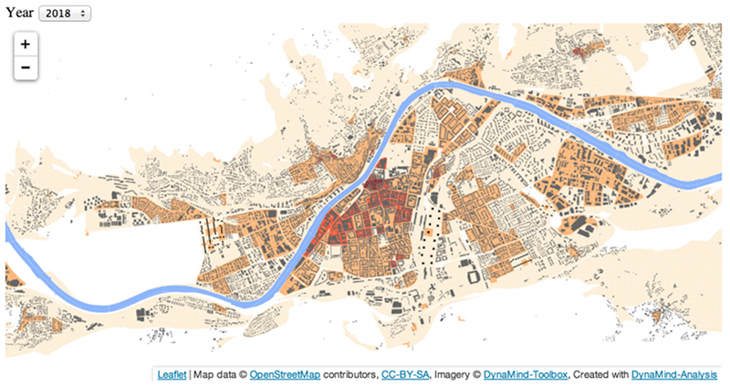

DynaMind-Analysis
=================

DynaMind-Analysis are set of tool boxes to export and visualise data of a DynaMind-Toolbox simulation. E.g. the Tiel-Mill module that creates map tiles that later can be viewed with a html viewer based on [leaflet](http://leafletjs.com/)

 